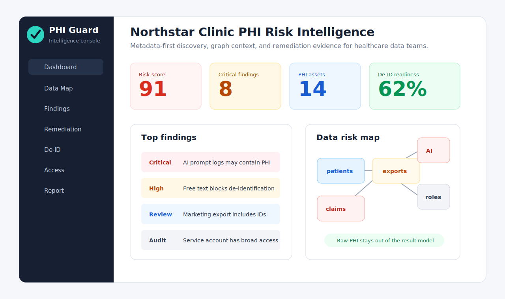
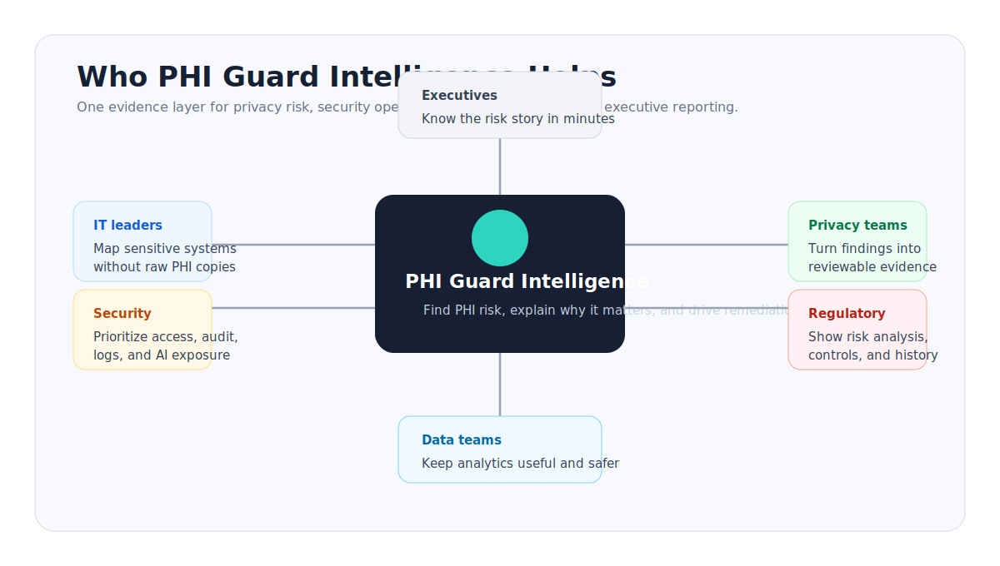

# PHI Guard Intelligence One-Pager

## Executive Pitch

PHI Guard Intelligence is a healthcare data risk intelligence platform for teams that need to know where protected health information may live, how it moves, who can access it, and what should be fixed first.

Most healthcare organizations have a visibility problem before they have a remediation problem. PHI may be present in production databases, analytics exports, support logs, AI prompt tables, CSV extracts, dbt models, FHIR payloads, and operational notes. PHI Guard Intelligence gives IT, security, privacy, data, and compliance teams a shared map of that risk without making raw PHI the center of the product.

## Who It Is For

- Healthcare IT leaders who need a defensible view of sensitive data movement.
- Security teams who need to prioritize access, audit, log, and AI exposure risks.
- Privacy and compliance teams who need evidence for risk analysis and remediation.
- Data and analytics teams who need safer de-identification and export readiness checks.
- Regulatory and vendor review audiences who need clear controls, audit history, and limitations.

## The Problem

Healthcare teams are being asked to move faster with analytics, automation, AI workflows, and vendor integrations while proving they still understand where ePHI is created, received, maintained, transmitted, exported, and logged.

Traditional tools tend to split the problem:

- Data catalogs show assets but often miss privacy risk reasoning.
- DLP tools detect content but rarely explain lineage and remediation context.
- GRC tools track controls but usually depend on manual evidence.
- Security dashboards highlight events but may not understand de-identification blockers.

PHI Guard Intelligence connects those layers.

## The Product

PHI Guard Intelligence scans metadata, masked samples, local files, and modeled access grants to build an interactive risk intelligence map. It classifies columns, maps lineage, scores findings, explains why each finding matters, and turns findings into remediation tasks.

Core capabilities:

- PHI/ePHI discovery for identifiers, quasi-identifiers, health context, payment context, free text, linkable keys, and AI exposure signals.
- Graph-based view of tables, columns, exports, roles, AI/log destinations, findings, and controls.
- De-identification readiness heatmap based on Safe Harbor-style blocker categories.
- Access matrix for role exposure and minimum-necessary review.
- Explainable risk scores with impact, likelihood, exposure, control gap, and confidence.
- Remediation backlog with owners, due windows, effort, controls, and human-review notes.
- Local scanner agent that emits sanitized evidence packages before API submission.

## Business Value

PHI Guard Intelligence helps buyers reduce time-to-understanding:

- From scattered database knowledge to a shared PHI risk map.
- From vague compliance concern to prioritized remediation.
- From one-off spreadsheet reviews to repeatable scan history.
- From "do we have PHI in logs or AI workflows?" to visible evidence.
- From technical findings to executive-ready reporting.

## Regulatory Positioning

PHI Guard Intelligence is intentionally framed as HIPAA-oriented risk intelligence. It does not provide legal advice, certify compliance, or prove a violation. It helps teams organize evidence, identify potential privacy and security risks, and support human review.

The product aligns its language with public HHS guidance:

- HHS OCR describes risk analysis as a foundational Security Rule process for identifying risks and vulnerabilities to ePHI: https://www.hhs.gov/hipaa/for-professionals/security/guidance/guidance-risk-analysis/index.html
- HHS OCR describes the Privacy Rule de-identification methods as Expert Determination and Safe Harbor: https://www.hhs.gov/hipaa/for-professionals/privacy/special-topics/de-identification/index.html
- HHS summarizes Safe Harbor identifier categories such as names, geographic subdivisions, dates, phone numbers, email addresses, SSNs, medical record numbers, account numbers, IP addresses, biometric identifiers, full-face images, and other unique identifying codes: https://www.hhs.gov/hipaa/for-professionals/privacy/laws-regulations/index.html

## Why This MVP Is Credible

- It has a working FastAPI backend, React/TypeScript frontend, Python scanner, local scanner-agent CLI, PostgreSQL metadata schema, Docker scaffolding, and unit tests.
- It uses synthetic Northstar Clinic demo data and clearly warns against uploading real PHI to local/mock upload mode.
- The evidence model stores masked snippets and booleans, not raw patient identifiers.
- It includes scanner-agent ingestion that rejects raw-retention markers.
- It documents architecture, threat model, no-raw-PHI storage, secure upload requirements, deployment, and real-client readiness.

## Demo Story

Start with the executive dashboard, then show:

1. A critical AI prompt/log risk.
2. A free-text de-identification blocker.
3. A marketing export with identifiers and diagnosis context.
4. A broad service-account or analyst role with combined PHI access.
5. The remediation backlog that turns those findings into owners and actions.

The strongest close: PHI Guard Intelligence is not just a scanner. It is a decision surface that helps healthcare teams move from discovery to evidence-backed remediation.

