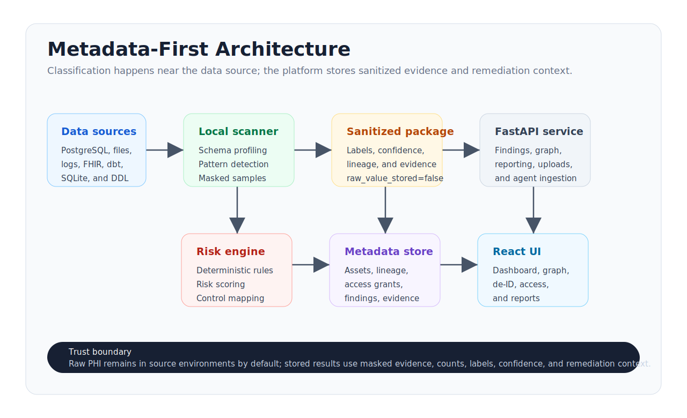
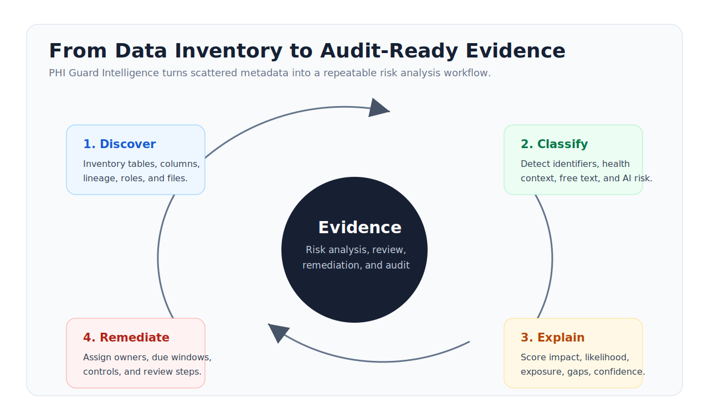

# PHI Guard Intelligence

## Healthcare Data Risk Intelligence

PHI Guard Intelligence helps healthcare, IT, security, privacy, and regulatory teams find where potential PHI risk lives, understand how it moves, and turn findings into evidence-backed remediation.

---

# 1. The Problem

Healthcare data is no longer contained in one EHR database.

It moves through:

- production databases
- analytics exports
- support tickets and logs
- AI prompt and model workflow tables
- CSV and SQLite extracts
- FHIR and dbt pipelines
- vendors, campaigns, dashboards, and reporting tools

The risk question is simple but hard to answer:

> Where is PHI, who can access it, where does it flow, and what should we fix first?

---

# 2. Why Existing Tools Leave Gaps

Data catalogs inventory assets, but often do not explain healthcare privacy risk.

DLP tools detect content, but often miss lineage, access, and remediation context.

GRC tools track controls, but often rely on manual evidence.

Security dashboards show events, but may not understand de-identification blockers or PHI concentration.

PHI Guard Intelligence connects those layers into a single risk intelligence surface.

---

# 3. The Product

PHI Guard Intelligence scans metadata and masked signals, builds a graph of the data estate, classifies PHI-risk patterns, scores findings, and creates remediation tasks.

Core views:

- Executive dashboard
- Interactive data risk map
- Finding detail and evidence
- De-identification readiness heatmap
- Access matrix
- Remediation backlog
- Executive report

---

# 4. Who It Helps

The same evidence layer supports:

- IT leaders: data estate visibility
- Security teams: access, audit, log, and AI risk
- Privacy teams: reviewable evidence and control mapping
- Regulatory audiences: repeatable risk analysis artifacts
- Data teams: safer analytics and export readiness

---

# 5. What Makes It Different

PHI Guard Intelligence is healthcare-specific.

It looks for:

- direct identifiers
- quasi-identifiers
- health and payment context
- free-text PHI risk
- linkable keys
- de-identification blockers
- AI and prompt exposure
- access-control gaps
- lineage-propagated risk

Then it explains each finding with risk factors, blast radius, evidence, controls, recommended steps, and human-review notes.

---

# 6. Technical Architecture

Production direction:

1. Scanner runs near the customer data source.
2. Classification happens locally.
3. Only sanitized metadata and evidence are sent to the API.
4. The platform stores graph, findings, controls, remediation, and audit history.

---

# 7. Regulatory Evidence Loop

PHI Guard Intelligence supports a repeatable workflow:

1. Discover assets and access.
2. Classify PHI-risk signals.
3. Explain impact, likelihood, exposure, gaps, and confidence.
4. Remediate with owner-ready tasks.
5. Preserve scan history and audit events.

It supports review. It does not certify compliance or replace legal counsel.

---

# 8. Demo Narrative

Start with the Northstar Clinic dashboard.

Show five moments:

1. AI prompt/log table with PHI-risk signals.
2. Free-text notes that block de-identification readiness.
3. Marketing export with identifiers and diagnosis context.
4. Broad analyst/service-account access to combined PHI.
5. Remediation backlog with controls, owners, effort, and due windows.

Close with the report view.

---

# 9. MVP Credibility

The project includes:

- React/TypeScript/Vite frontend
- FastAPI backend
- Python scanner and rule engine
- Local scanner-agent CLI
- PostgreSQL metadata schema
- Docker scaffolding
- Synthetic healthcare demo data
- Unit tests for API, classifier, importer, demo, and agent flows
- Security, architecture, data model, and readiness docs

This is not just a mockup. It is a working product prototype.

---

# 10. Buyer Close

PHI Guard Intelligence gives healthcare organizations a practical answer to a high-stakes question:

> Can we see our PHI risk clearly enough to reduce it?

The answer becomes visible:

- where PHI risk lives
- how it moves
- who can access it
- why each risk matters
- what should be fixed first
- what evidence remains for review

---

# Sources And Guardrails

PHI Guard Intelligence is HIPAA-oriented risk intelligence, not legal advice or compliance certification.

Public HHS references used for positioning:

- Risk analysis guidance: https://www.hhs.gov/hipaa/for-professionals/security/guidance/guidance-risk-analysis/index.html
- De-identification guidance: https://www.hhs.gov/hipaa/for-professionals/privacy/special-topics/de-identification/index.html
- Privacy Rule summary and Safe Harbor categories: https://www.hhs.gov/hipaa/for-professionals/privacy/laws-regulations/index.html
